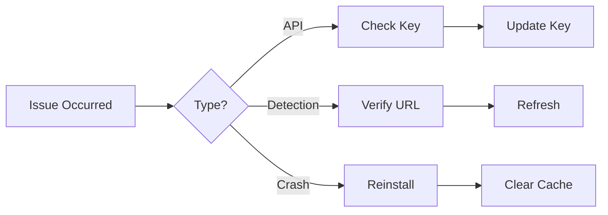

# 🔍 LeetCode AI Helper - Chrome Extension


https://github.com/user-attachments/assets/12e3b708-a10d-4964-85c4-6a5a14cd0c55


  

  <br>
  <em>Your AI-powered LeetCode companion right in the browser</em>
</p>


## ✨ Features

**Smart Integration**
- 🎯 Auto-detects LeetCode problems
- 🤖 Gemini AI-powered solutions
- 📝 Detailed explanations with complexity analysis

**User Experience**
- 🖱️ One-click solution generation
- 🔒 Secure API key management
- 🎨 Clean, intuitive interface

## 🚀 Installation

### Prerequisites
- Google Chrome (latest version recommended)
- [Gemini API key](https://ai.google.dev/)

### Quick Setup
```
git clone https://github.com/your-repo/LeetCodeAIHelper.git
cd LeetCodeAIHelper
```
1. Open Chrome and navigate to chrome://extensions

2. Enable Developer mode (top-right toggle)

3. Click Load unpacked and select the cloned folder

4. Pin the extension from Chrome's toolbar

## 🛠️ Usage

### 🔧 First-Time Configuration

1. **Access Options**  
   Right-click the extension icon in your toolbar and select `Options`  
   *(or click the extension icon then the gear ⚙️ button)*

2. **Enter API Key**  
   ```plaintext
   ┌───────────────────────────────────────┐
   │  🔑 Gemini API Key:                   │
   │  ┌─────────────────────────────────┐  │
   │  │                                 │  │
   │  └─────────────────────────────────┘  │
   │                                       │
   │  [✔️ Save Settings]    [❌ Cancel]     │
   └───────────────────────────────────────┘
   Get your key from Google AI Studio
   ```
3. Save Settings

-Click Save Settings

-Look for the green confirmation toast:
✅ Settings saved successfully!

## 🧠 Getting AI Solutions


## 🐛 Troubleshooting

### Common Issues and Solutions

| Symptom               | Solution Steps                                                                 | Additional Notes                                                                 |
|-----------------------|-------------------------------------------------------------------------------|---------------------------------------------------------------------------------|
| **❌ API Key Errors**  | 1. Verify key at [Google AI Studio](https://ai.google.dev/)<br>2. Update in extension options<br>3. Reload extension | 🔑 Key should start with `AIza...` |
| **🔍 Problem Not Detected** | 1. Ensure URL matches `leetcode.com/problems/...`<br>2. Refresh page (Ctrl+F5)<br>3. Login to LeetCode | Works on all problem types (easy/medium/hard) |
| **🌀 Extension Crashes** | 1. Disable/re-enable extension<br>2. Clear browser cache<br>3. [Reinstall extension](#installation) | Try Chrome's `Reset settings` if persistent |


# 📁 Project Structure

```bash
LeetCodeAIHelper/
├── 📄 manifest.json          # Extension configuration file
├── 📜 background.js         # Background service worker
├── 📜 content.js            # Content injection scripts
├── 🖼️ icon.png              # Extension icon (128x128 recommended)
├── 📂 options/              # Settings page components
│   ├── 📄 options.html      # Options page UI
│   └── 📜 options.js        # Options page logic
├── 📂 popup/                # Popup interface
│   ├── 📄 popup.html        # Popup HTML structure
│   ├── 📜 popup.js          # Popup functionality
│   └── 🎨 popup.css         # Popup styling
```
# 🤝 How to Contribute
### 🛠️ Development Setup
1. Fork the Repository
https://img.shields.io/badge/-Fork%2520Repository-181717?style=for-the-badge&logo=github
2. Clone and Install
   ```bash
   git clone https://github.com/your-username/LeetCodeAIHelper.git
   cd LeetCodeAIHelper
   npm install
   ```
3. Development Scripts
    ```bash
   npm run dev    # Watch mode for development
   npm run build  # Production build
   npm test       # Run tests
   ```
## 📝 Coding Standards

| Language    | Style Guide       | Linter   | Configuration | Visual Badge |
|------------|-------------------|----------|---------------|--------------|
| JavaScript | [Airbnb](https://github.com/airbnb/javascript) | ESLint | `.eslintrc` |  |
| HTML       | [Semantic HTML5](https://developer.mozilla.org/en-US/docs/Glossary/Semantics) | HTMLHint | `.htmlhintrc` |  |
| CSS        | [BEM](http://getbem.com/) | Stylelint | `.stylelintrc` |  |

### Key Features:
- **Clickable links** to each style guide
- **Visual badges** for quick recognition
- **Configuration file** references
- **Mobile-responsive** table design

## 📜 License

## MIT License

Copyright (c) 2023 Your Name

Permission is hereby granted, free of charge, to any person obtaining a copy
of this software and associated documentation files (the "Software"), to deal
in the Software without restriction, including without limitation the rights
to use, copy, modify, merge, publish, distribute, sublicense, and/or sell
copies of the Software...


